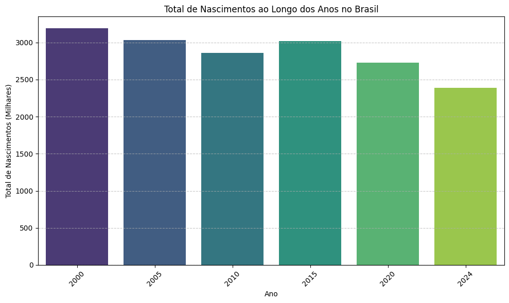
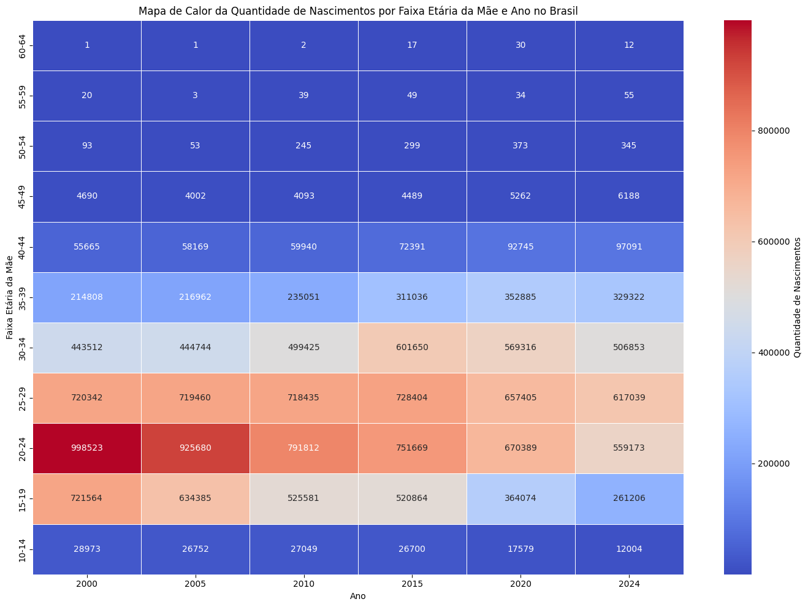

# Relatório

> [!CAUTION]
>
> - Você <ins>**não pode utilizar ferramentas de IA para escrever este relatório**</ins>.

## Identificação

- **Nome**: <mark>`Gilmar Félix da Rosa`</mark>
- **Cartão UFRGS:** <mark>`00303051`</mark>

## Dados utilizados

> [!IMPORTANT]
>
> - Os dados utilizados devem ser informados como **links** para as fontes originais.
> - Se houver mais de um conjunto de dados, liste todos separadamente.
> - Para cada conjunto de dados, inclua também uma **descrição curta** explicando os dados.

1. **Dataset 1**: <mark>`[<link>](https://tabnet.datasus.gov.br/cgi/deftohtm.exe?sinasc/cnv/nvbr.def)`</mark>
    * **Descrição curta**: <mark>`Eu realizei a busca colocando em linhas os municipios, em colunas as idades das mães e conteúdo por residência da mãe. A busca mostra os nascimentos em cada ano no brasil, selecionei os anos 2000, 2005, 2010, 2015, 2020 e 2024 `</mark>
2. **Dataset 2**: <mark>`<link>`</mark>
    * **Descrição curta**: <mark>`<preencher>`</mark>
3. ...

## Código-fonte da visualização

> [!IMPORTANT]
>
> - Indique abaixo onde está, dentro deste repositório, o código-fonte usado para gerar a visualização.

- **Arquivo principal**: <mark>`Nascimentos_No_Brasil_Gilmar.ipynb`</mark>
- **Arquivos complementares (se houver)**: <mark>`<preencher>`</mark>

## Imagem da visualização gerada

> [!IMPORTANT]
>
> - Insira aqui uma imagem da visualização criada por você. Troque `imagem-da-visualizacao.png` pelo caminho correto do arquivo no repositório. 
> - Se você criou alguma visualização interativa, então descreva aqui como acessá-la. Por exemplo, se for uma página HTML, coloque o link, ou se for uma visualização 3D, descreva como compilar e executar o código. 

<mark>`<preencher abaixo>`</mark>

## Descrição da visualização

### Legenda (*caption*)

> [!IMPORTANT]
>
> - Escreva um texto curto explicando como interpretar a visualização. Descreva os elementos visuais, eixos, cores, símbolos ou interações relevantes.
> - Este texto seria a legenda (*caption*) que acompanharia a figura em uma publicação, por exemplo.

<mark>`No eixo x tem os anos e no eixo y a quantidade de nascimentos de 0 a 3000, onde cada valor representa milhares, ou seja vai de 0 a 3000000`</mark>

## Imagem da visualização gerada

## Descrição da visualização

### Legenda (*caption*)

> [!IMPORTANT]
>
> - Escreva um texto curto explicando como interpretar a visualização. Descreva os elementos visuais, eixos, cores, símbolos ou interações relevantes.
> - Este texto seria a legenda (*caption*) que acompanharia a figura em uma publicação, por exemplo.

<mark>`No eixo x tem os anos e no eixo y as faixa etarias das mães. Quanto mais intensa for a cor do azul menor é a quantidade de nascimentos e quanto mais intensa for a cor do vermelho maior sera a quantidade de nascimentos. E dentro da cada caixinha do mapa de calor tem a quantidade de nascimentos.`</mark>

### Conclusão demonstrada pela visualização

> [!IMPORTANT]
>
> - Escreva uma conclusão curta sobre os dados com base na visualização.
> - Explique qual insight, padrão ou tendência pode ser observado.

<mark>`No grafico de barras é possivel visualizar uma queda significativa na quantidade total de nascimentos no brasil nos ultimos anos. No mapa de calor é possivel identificar as faixas etarias em que os brasileiros costumam ter filhos, também é possivel identificar que houve uma mudança gradativa ao longo dos anos da faixa etaria onde as pessoas mais tem filhos. Outros fatores interessantes que o mapa de calor mostra é como diminuiu a quantidade de nascimentos na faixa etaria de 10 a 14 anos, e também como nas faixas etarias mais elevadas como 50 a 54 e 55 a 59 houve um aumento de nascimentos.`</mark>
